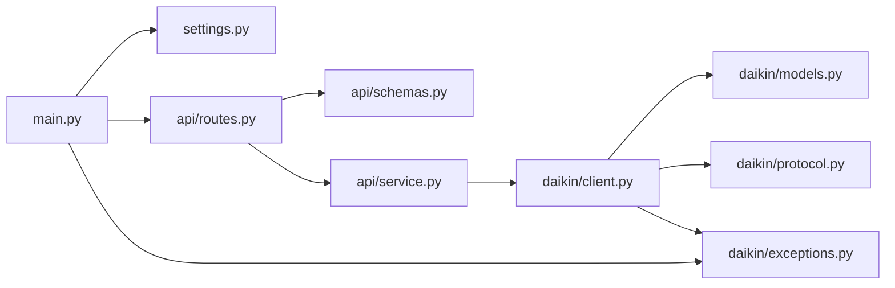

# Daikin MCK706A API

ダイキンの加湿空気清浄機 **MCK706A-W** のローカル `dsiot` API（「DAIKIN Smart
APP」が内部で叩く API）を FastAPI + Pydantic でラップした REST サーバーです。
クラウドを介さず、同一 LAN から空気の状態（温度・湿度・運転状態など）を取得し、
電源の ON/OFF などを操作できます。

## セットアップ

`.env` に接続先を記載します（`DAIKIN_HOST` は必須、`TIMEOUT` は省略可で既定 10 秒）。

```dotenv
DAIKIN_HOST=http://192.168.1.100
TIMEOUT=10
```

依存関係のインストールと `.env` の雛形作成（`.env.example` をコピー）:

```bash
make setup   # = uv sync + cp .env.example .env（.env が無いときだけ）
```

## 起動

```bash
make run   # = uv run uvicorn main:app --reload --app-dir src --host 127.0.0.1 --port 8000
```

- Swagger UI: http://127.0.0.1:8000/docs

### Docker

```bash
make build-image                       # docker build -t daikin-mck706a-api:latest .
docker run --rm -p 8000:8000 --env-file .env daikin-mck706a-api:latest
```

多段ビルド（`uv` ビルダ → `python:slim` ランナー、非 root 実行）。

## エンドポイント

| Method | Path           | 説明                                             |
| ------ | -------------- | ------------------------------------------------ |
| GET    | `/api/health`  | サーバー状態と接続先                              |
| GET    | `/api/info`    | 機種情報（name/mac/firmware/ssid/led 等）        |
| GET    | `/api/status`  | 空気・運転状態（電源/温度/湿度/モード/風量/センサー） |
| GET    | `/api/tree`    | `adr_0100.dgc_status` 全リーフの復号済みツリー    |
| POST   | `/api/read`    | 任意の dsiot アドレスの生読み取り                  |
| POST   | `/api/write`   | 任意プロパティの書き込み（`confirm: true` 必須。無い・false は 422） |
| POST   | `/api/power`   | 電源 ON/OFF                                       |

### エラー

| Status | 意味 |
| ------ | ---- |
| 422    | リクエストの検証エラー（アドレス形式、`confirm` 欠落など） |
| 502    | 本体がエラーを返した、または応答を解釈できない（`detail` と dsiot の `rsc`。`2000` が正常） |
| 504    | 本体へ到達できない（タイムアウト・接続拒否） |

### 空気状態の取得例

```bash
curl http://127.0.0.1:8000/api/status
```

```json
{
  "power": true,
  "temperature_c": 24.0,
  "humidity_pct": 65,
  "mode": 2,
  "fan_rate": 2,
  "monitors": {"monitor_a": 252, "monitor_b": 130, "pm_a": 660, "pm_b": 660}
}
```

### 電源操作例

```bash
curl -X POST http://127.0.0.1:8000/api/power \
  -H 'Content-Type: application/json' -d '{"on": false}'
```

### 汎用パススルー

読み取り:

```bash
curl -X POST http://127.0.0.1:8000/api/read \
  -H 'Content-Type: application/json' \
  -d '{"targets":["/dsiot/edge/adr_0100.dgc_status","/dsiot/edge.adp_i"]}'
```

書き込み（破壊的・`confirm` 必須）:

```bash
curl -X POST http://127.0.0.1:8000/api/write \
  -H 'Content-Type: application/json' \
  -d '{"to":"/dsiot/edge/adr_0100.dgc_status","entity_path":["e_1002","e_A002","p_01"],"pv":"00","confirm":true}'
```

- `pv` はリトルエンディアンの16進文字列（偶数長）。
- `entity_path` はレスポンスのルート（`dgc_status`）配下のプロパティ名の連なり。

## 開発

ruff（lint + formatter）、ty（型チェック）、pre-commit、pytest を使用します。

```bash
make format   # ruff format .
make lint     # ruff format --check + ruff check + ty check
make test     # coverage run -m pytest + report（オフライン。実機には触れません）

make precommit-install   # フックを git に登録
make precommit           # 全ファイルに対して実行
```

CI（GitHub Actions）は `pre-commit run --all-files` と `pytest` を実行します。

## 仕組み

新しめのダイキン機（ファームウェア `3_15_0` / `api_ver 2_2` の MCK706A）は、
旧来の `/cleaner/*`・`/common/*` といった REST エンドポイントを持たず、単一の
JSON エンドポイントだけを公開しています。

```
POST http://<host>/dsiot/multireq
```

ボディは `requests` 配列で、各要素が操作コード `op` と対象パス `to` を持ちます。

- `op=2` … プロパティツリーの**読み取り**
- `op=3` … プロパティツリーの**書き込み**（`pc`）

レスポンスは*プロパティノード*のツリーです。各ノードは以下を持ちます。

- `pn` … プロパティ名（`e_1002`, `p_01` など）
- `pt` … 型（`1`=子 `pch` を持つコンテナ、それ以外=リーフ）
- `pv` … 値（リーフのみ）
- `md` … メタ情報。`md.pt` が値の符号化方式（`"b"`=リトルエンディアン16進バイト列、
  `"i"`=整数、`"s"`=文字列）、`md.mi`/`md.mx` が最小/最大値（16進）

> 認証はありません。LAN 内の誰でも読み書きできます。
> 主要アドレス: `/dsiot/edge/adr_0100.dgc_status`（制御＋センサー）、
> `/dsiot/edge.adp_i`（FW/MAC/SSID 等）、`/dsiot/edge.adp_d`（名前/LED/TZ 等）。

### フィールドの確度

`dsiot` の各フィールド意味はダイキン非公開です。本実装では実機を解析して
次のように分類しています。

| 分類 | フィールド | 備考 |
| ---- | --------- | ---- |
| **確定** | `power` `temperature_c` `humidity_pct` | 実機で検証（温度は int16 LE の半度単位） |
| **暫定** | `mode`（0..5） `fan_rate`（0..7） | 範囲は判明、ラベルは未確定のため生の整数で公開 |
| **未マップ** | `monitors.*`（PM2.5/ホコリ/ニオイ相当） | 値は変動するが単位未確定。生のデコード値を公開 |

未マップのセンサーを特定したい場合は、`GET /api/tree` で完全な復号済みツリーを
取得し、一定間隔でポーリングして「変動するフィールド」を炙り出せます。例えば
ニオイセンサーの近くで息を吹きかけ、どの `e_*/p_*` が動くかを観察して対応付けます。

## 構成

`src/` 直下をトップレベルパッケージとして解決する virtual プロジェクト（ビルドなし）。
実行・テストは `--app-dir src` / `pythonpath = ["src"]` / `PYTHONPATH=src` で解決します。

```
src/
  daikin/          dsiot ローカル API クライアント（FastAPI 非依存・単体利用可）
    protocol.py      multireq 本文の組み立て、16 進デコーダ、PropertyTree
    models.py        DeviceInfo / AirStatus / DecodedLeaf（client の戻り値）
    client.py        DaikinClient（通信、MCK706A のアドレス・プロパティパス、高レベル API）
    exceptions.py    DaikinError / DaikinConnectionError
  api/             FastAPI 層
    routes.py        エンドポイント定義
    schemas.py       request モデル
    service.py       DaikinClient を lock + worker thread で直列実行する DaikinService
  settings.py      環境変数（pydantic-settings）
  main.py          FastAPI アプリと、例外 → HTTP status の対応
tests/             オフライン単体テスト（src の構成をミラー）
```



新しいプロパティを公開するときは、`client.py` にプロパティパスの定数と
`tree.decode(パス, デコーダ)` の 1 行、`models.py` に対応するフィールドを足します。
デコーダ（`hex_to_int` / `hex_to_bool` / `hex_to_temp` / `int_to_bool` など）は
`protocol.py` にあります。

## 注意

- ローカルネットワーク内（同一サブネット）からの利用を想定しています。認証は
  ありません。
- ファームウェアによってフィールドが異なる場合があります。`/api/info`・`/api/status`
  は既知のフィールドだけを返すので、生の値は `/api/tree`（復号済み）や `/api/read`
  （dsiot 応答そのまま）で確認してください。

## 免責 / Disclaimer

本プロジェクトは **ダイキン非公式**であり、ダイキン工業株式会社とは一切関係あり
ません。公開されていないローカル API をリバースエンジニアリングして利用しています。

- **自分が管理権限を持つ機器に対してのみ**使用してください。
- ファームウェア更新で API が予告なく変わる可能性があります。
- 本ソフトウェアは現状有姿（AS IS）で提供され、いかなる保証もありません。

## 謝辞 / Acknowledgements

`dsiot`（`/dsiot/multireq`）プロトコルの構造と温度/湿度のデコード方式は、ダイキンの
新ファームウェア（BRP084 系）を対象とした以下の公開リバースエンジニアリング成果を
参考にしています。

- [Apoc182/local_daikin](https://github.com/Apoc182/local_daikin)
- [Chris971991/homeassistant-daikin-optimized](https://github.com/Chris971991/homeassistant-daikin-optimized)

空気清浄機（MCK）固有のフィールドは実機（MCK706A / FW 3_15_0）を解析して確認しました。

## ライセンス / License

[MIT](LICENSE)
