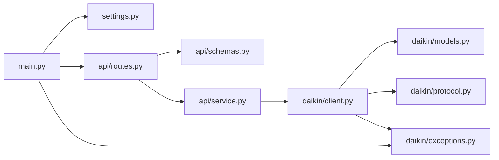

# Daikin MCK706A API

ダイキンの加湿空気清浄機 **MCK706A-W** のローカル `dsiot` API（「DAIKIN Smart
APP」が内部で叩く API）を FastAPI + Pydantic でラップした REST サーバーです。
クラウドを介さず、同一 LAN から空気の状態（温度・湿度・PM2.5 / ホコリ / ニオイの
レベルなど）を取得し、電源・加湿・コース・風量・湿度設定を操作できます。

## セットアップ

`.env` に接続先を記載します（`DAIKIN_HOST` は必須、`TIMEOUT` は省略可で既定 10 秒）。

```dotenv
DAIKIN_HOST=http://192.168.1.100
TIMEOUT=10
```

依存関係のインストールと `.env` の雛形作成（`.env.example` をコピー）:

```bash
make setup   # = uv sync + cp .env.example .env（.env が無いときだけ）
```

## 起動

```bash
make run   # = uv run uvicorn main:app --reload --app-dir src --host 127.0.0.1 --port 8000
```

- Swagger UI: http://127.0.0.1:8000/docs

### Docker

```bash
make build-image                       # docker build -t daikin-mck706a-api:latest .
docker run --rm -p 8000:8000 --env-file .env daikin-mck706a-api:latest
```

多段ビルド（`uv` ビルダ → `python:slim` ランナー、非 root 実行）。

## エンドポイント

| Method | Path              | 説明                                                                 |
| ------ | ----------------- | -------------------------------------------------------------------- |
| GET    | `/api/health`     | サーバー状態と接続先                                                  |
| GET    | `/api/info`       | 機器情報（name / device_type / mac / firmware / 接続中 Wi-Fi の SSID・RSSI / led 等） |
| GET    | `/api/status`     | 運転状態とセンサー値（電源 / 加湿 / コース / 風量 / 湿度設定 / 温湿度 / 空気質レベル / 各種サイン） |
| GET    | `/api/tree`       | `adr_0100.dgc_status` 全リーフの復号済みツリー                        |
| POST   | `/api/read`       | 任意の dsiot アドレスの生読み取り                                      |
| POST   | `/api/write`      | 任意プロパティの書き込み（`confirm: true` 必須。無い・false は 422）    |
| POST   | `/api/power`      | 電源 ON/OFF（`{"on": true}`）                                         |
| POST   | `/api/humidify`   | 運転切替。加湿 + 空気清浄 / 空気清浄のみ（`{"on": true}`）             |
| POST   | `/api/course`     | コース変更（`{"course": "pollen"}`）                                   |
| POST   | `/api/fan-speed`  | 手動コースの風量（`{"fan_speed": "turbo"}`）                           |
| POST   | `/api/humidity-setting` | 加湿側コースの湿度設定（`{"humidity_setting": "standard"}`）     |

### 値の一覧

| 項目 | 値 | 備考 |
| ---- | -- | ---- |
| `course` | `smart` `manual` `auto_fan` `econo` `pollen` `moist` `circulator` `laundry_dry` `night_laundry_dry` `water_deodorize` `internal_dry` | MCK706A が選べるのは `smart`〜`circulator`。`moist`（のど・はだ）は加湿運転時のみ |
| `fan_speed` | `quiet` `low` `standard` `high` `turbo` | MCK706A は `high` 非対応。コースが `manual` のときだけ運転に反映される |
| `humidity_setting` | `off` `low` `standard` `high` `continuous` | MCK706A は `low` / `standard` / `high` のみ。コースが `smart` / `moist` のときは自動で変更不可 |

本体が対応しない値や、現在の運転状態では選べない値（空気清浄のみのときの `moist`、
加湿側コースが `smart` のときの湿度設定）は本体に送らず 409 で返します。対応範囲は本体が
`md.mx`（対応値のビットマスク）として申告するものを使います。

### エラー

| Status | 意味 |
| ------ | ---- |
| 409    | 本体の対応範囲、または現在の運転状態では行えない操作 |
| 422    | リクエストの検証エラー（アドレス形式、`confirm` 欠落、未知の値など） |
| 502    | 本体がエラーを返した、または応答を解釈できない（`detail` と dsiot の `rsc`。`200x` が成功） |
| 504    | 本体へ到達できない（タイムアウト・接続拒否） |

`/api/write` で対応範囲外の値（運転切替 `01`、コード 11 以上のコースなど）を書いて
しまうと、以降 `/api/status` はその値を復号できず 502 になります。`GET /api/tree` で
該当プロパティを見つけ、対応する setter（`/api/humidify` `/api/course` `/api/fan-speed`
`/api/humidity-setting`）か `/api/write` で範囲内の値に戻してください。

### 空気状態の取得例

```bash
curl http://127.0.0.1:8000/api/status
```

```json
{
  "power": true,
  "humidify": false,
  "course": "smart",
  "fan_speed": "quiet",
  "humidity_setting": null,
  "temperature_c": 23.0,
  "humidity_pct": 73,
  "pm25_level": 0,
  "dust_level": 0,
  "odor_level": 0,
  "pm25_raw": 659,
  "dust_raw": 624,
  "odor_raw": 1018,
  "water_supply_sign": false,
  "filter_drying": false,
  "deodorizing_filter_off_sign": false,
  "streamer_maintenance_sign": false,
  "error_code": "00-00"
}
```

`course` と `fan_speed` は現在の運転切替（`humidify`）側の設定です。本体は空気清浄側と
加湿側の設定を別々に保持していて、MCK706A では片方を変えると数秒遅れでもう片方にも
同じ値が同期されます（実機で観測）。`humidity_setting` は加湿側コースに対する設定で、
`humidify` が false のときも値を返します。同期が終わるまでの数秒は `course` と
加湿側コースが食い違うので、`/api/course` の直後に `/api/humidity-setting` を叩くときは
`/api/status` で `humidity_setting` が期待どおりか確認してください。

### 操作例

```bash
curl -X POST http://127.0.0.1:8000/api/power \
  -H 'Content-Type: application/json' -d '{"on": false}'

curl -X POST http://127.0.0.1:8000/api/humidify \
  -H 'Content-Type: application/json' -d '{"on": true}'

curl -X POST http://127.0.0.1:8000/api/course \
  -H 'Content-Type: application/json' -d '{"course": "manual"}'

curl -X POST http://127.0.0.1:8000/api/fan-speed \
  -H 'Content-Type: application/json' -d '{"fan_speed": "turbo"}'

curl -X POST http://127.0.0.1:8000/api/humidity-setting \
  -H 'Content-Type: application/json' -d '{"humidity_setting": "standard"}'
```

### 汎用パススルー

読み取り（`/dsiot/edge` を指定すると本体が持つ全アドレスを一括で列挙できます）:

```bash
curl -X POST http://127.0.0.1:8000/api/read \
  -H 'Content-Type: application/json' \
  -d '{"targets":["/dsiot/edge/adr_0100.dgc_status","/dsiot/edge.adp_i"]}'
```

書き込み（破壊的・`confirm` 必須）:

```bash
curl -X POST http://127.0.0.1:8000/api/write \
  -H 'Content-Type: application/json' \
  -d '{"to":"/dsiot/edge/adr_0100.dgc_status","entity_path":["e_1002","e_A002","p_01"],"pv":"00","confirm":true}'
```

- `pv` はリトルエンディアンの16進文字列（偶数長）。
- `entity_path` はレスポンスのルート（`dgc_status`）配下のプロパティ名の連なり。
- 本体は `md.mx` の範囲外の値も拒否せず保存するので、生書き込みでは範囲を自分で守ってください。

## 開発

ruff（lint + formatter）、ty（型チェック）、pre-commit、pytest を使用します。

```bash
make format   # ruff format .
make lint     # ruff format --check + ruff check + ty check
make test     # coverage run -m pytest + report（オフライン。実機には触れません）

make precommit-install   # フックを git に登録
make precommit           # 全ファイルに対して実行
```

CI（GitHub Actions）は `pre-commit run --all-files` と `pytest` を実行します。

## 仕組み

新しめのダイキン機（ファームウェア `3_15_0` / `api_ver 2_2` の MCK706A）は、
旧来の `/cleaner/*`・`/common/*` といった REST エンドポイントを持たず、単一の
JSON エンドポイントだけを公開しています。

```
POST http://<host>/dsiot/multireq
```

ボディは `requests` 配列で、各要素が操作コード `op` と対象パス `to` を持ちます。

- `op=2` … プロパティツリーの**読み取り**
- `op=3` … プロパティツリーの**書き込み**（`pc`）

レスポンスは*プロパティノード*のツリーです。各ノードは以下を持ちます。

- `pn` … プロパティ名（`e_1002`, `p_01` など）
- `pt` … 型（`1`=子 `pch` を持つコンテナ、`2` / `3`=リーフ。実機では概ね設定値が `2`、
  センサー・固定情報が `3`。書き込み本文のリーフは `pt: 3` で送っても受け付けられる。実機で確認）
- `pv` … 値（リーフのみ）
- `md` … メタ情報。`md.pt` が値の符号化方式（`"b"`=リトルエンディアン16進バイト列、
  `"i"`=整数、`"s"`=文字列）、`md.mi`/`md.mx` が最小/最大値（16進）。列挙型の
  プロパティでは `md.mx` が対応値のビットマスク（bit n = 値 n）
- `rsc` … 結果コード。`200x` が成功（公式アプリの扱い。MCK706A は書き込み成功時に `2004` を返す）、
  `4000` パラメータ不正（公式アプリの定義）、`4041` 存在しないアドレス（実機で観測）

> 認証はありません。LAN 内の誰でも読み書きできます。

### アドレス

`/dsiot/edge` を読むと配下の全アドレスがまとめて返ります。MCK706A で読めるもの:

| アドレス | 内容 | 使う endpoint |
| -------- | ---- | ------------- |
| `/dsiot/edge/adr_0100.dgc_status` | 制御とセンサー | `/api/status` `/api/tree` 各 setter |
| `/dsiot/edge.adp_i` | アダプタ情報（FW / MAC / 自身の AP の SSID / api_ver / 機能フラグ） | `/api/info` |
| `/dsiot/edge.adp_d` | ユーザー設定（名前 / LED / タイムゾーン / 自動 OFF 通知） | `/api/info` |
| `/dsiot/edge.adp_r` | 無線の接続状態（接続中 SSID / RSSI）と再起動・FW 更新の履歴 | `/api/info` |
| `/dsiot/edge.dev_i` | 機器種別（`type` = `1D` が空気清浄機）と接続台数 | `/api/info` |
| `/dsiot/edge.adp_f` | FW 種別と自動更新の有効/無効 | `/api/read` のみ |
| `/dsiot/edge/adr_0100.scdl_t.info` / `.scdl_t.body` | 週間スケジュールタイマー（JSON 値） | `/api/read` のみ |
| `/dsiot/edge/adr_0200.dgc_status` | 空（室外機側。空気清浄機には無い） | — |

`adr_0100.history`（アプリの空気質履歴）と `adr_0100.i_power.*`（消費電力）は
この機体では `4041` で読めません。

### プロパティ対応表

`dgc_status` 配下のプロパティの意味は、公式 DAIKIN Smart App の空気清浄機向け定義
（`GPFCjConvertValue` の enum 表と `strings.xml` のラベル）を一次情報とし、実機
（MCK706A / FW 3_15_0）で読み書きして確認しています。

| フィールド | プロパティ | 値 | 確認 |
| ---------- | ---------- | -- | ---- |
| `power` | `e_1002/e_A002/p_01` | `00` / `01` | 実機で書き込み確認 |
| `humidify` | `e_1002/e_3001/p_3F` | `00` 空気清浄、`01` 除湿+空気清浄（MCK706A 非対応）、`02` 加湿+空気清浄 | 実機で書き込み確認 |
| `course` | `e_1002/e_3007/p_01`（空気清浄側）/ `p_03`（加湿側） | 2 バイト LE。下位バイトがコード（`00` smart … `06` circulator … `0A` internal_dry）、上位バイトは `00` | 実機で書き込み確認 |
| `fan_speed` | `e_1002/e_3007/p_04`（空気清浄側）/ `p_06`（加湿側） | `00` quiet … `04` turbo | 実機で書き込み確認 |
| `humidity_setting` | `e_1002/e_3007/p_12`〜`p_1C`（加湿側、コース順） | `00` off、`01` low、`02` standard、`03` high、`04` continuous | 実機で書き込み確認（`p_13`） |
| `temperature_c` | `e_1002/e_A00B/p_01` | int16 LE、0.5 ℃ 単位（`md.st`=0xF5） | 実機で確認 |
| `humidity_pct` | `e_1002/e_A00B/p_02` | % | 実機で確認 |
| `pm25_level` / `dust_level` / `odor_level` | `e_1002/e_3007/p_1D` / `p_1E` / `p_1F` | 0〜5 | 公式アプリ定義（読み取りのみ） |
| `pm25_raw` / `dust_raw` / `odor_raw` | `e_1002/e_3007/p_26` / `p_27` / `p_28` | 24 bit | アプリの履歴グラフの元値と推定。単位未特定 |
| `water_supply_sign` | `e_1002/e_3007/p_20` | flag | 公式アプリ定義 |
| `filter_drying` | `e_1002/e_3007/p_29` | flag | 公式アプリ定義 |
| `deodorizing_filter_off_sign` | `e_1002/e_3007/p_3E` | flag | 公式アプリ定義 |
| `streamer_maintenance_sign` | `e_1002/e_3001/p_40` | flag | 公式アプリ定義 |
| `error_code` | `e_1002/e_A004/p_09` | ASCII（`00-00` = 正常） | 公式アプリ定義 |

公式アプリの定義に無く意味が未特定のプロパティ（`e_3007/p_2B`〜`p_3D` の一部、
`e_205E`、`e_205F_*` など）は `/api/status` には含めず、`GET /api/tree` で生の値を
確認できます。一定間隔でポーリングして「変動するフィールド」を炙り出すのが手です。

## 構成

`src/` 直下をトップレベルパッケージとして解決する virtual プロジェクト（ビルドなし）。
実行・テストは `--app-dir src` / `pythonpath = ["src"]` / `PYTHONPATH=src` で解決します。

```
src/
  daikin/          dsiot ローカル API クライアント（FastAPI 非依存・単体利用可）
    protocol.py      multireq 本文の組み立て、16 進デコーダ、PropertyTree
    models.py        Course / FanSpeed / HumiditySetting、DeviceInfo / AirStatus / DecodedLeaf
    client.py        DaikinClient（通信、MCK706A のアドレス・プロパティパス・wire 値、高レベル API）
    exceptions.py    DaikinError / DaikinConnectionError / DaikinUnsupportedError
  api/             FastAPI 層
    routes.py        エンドポイント定義
    schemas.py       request モデル
    service.py       DaikinClient を lock + worker thread で直列実行する DaikinService
  settings.py      環境変数（pydantic-settings）
  main.py          FastAPI アプリと、例外 → HTTP status の対応
tests/             オフライン単体テスト（src の構成をミラー）
```



新しいプロパティを公開するときは、`client.py` にプロパティパスの定数と
`tree.decode(パス, デコーダ)` の 1 行、`models.py` に対応するフィールドを足します。
デコーダ（`hex_to_int` / `hex_to_bool` / `hex_to_temp` / `int_to_bool` など）は
`protocol.py` にあります。

## 注意

- ローカルネットワーク内（同一サブネット）からの利用を想定しています。認証は
  ありません。
- ファームウェアによってフィールドが異なる場合があります。`/api/info`・`/api/status`
  は既知のフィールドだけを返すので、生の値は `/api/tree`（復号済み）や `/api/read`
  （dsiot 応答そのまま）で確認してください。

## 免責 / Disclaimer

本プロジェクトは **ダイキン非公式**であり、ダイキン工業株式会社とは一切関係あり
ません。公開されていないローカル API をリバースエンジニアリングして利用しています。

- **自分が管理権限を持つ機器に対してのみ**使用してください。
- ファームウェア更新で API が予告なく変わる可能性があります。
- 本ソフトウェアは現状有姿（AS IS）で提供され、いかなる保証もありません。

## 謝辞 / Acknowledgements

`dsiot`（`/dsiot/multireq`）プロトコルの構造と温度/湿度のデコード方式は、ダイキンの
新ファームウェア（BRP084 系）を対象とした以下の公開リバースエンジニアリング成果を
参考にしています。

- [Apoc182/local_daikin](https://github.com/Apoc182/local_daikin)
- [Chris971991/homeassistant-daikin-optimized](https://github.com/Chris971991/homeassistant-daikin-optimized)

空気清浄機（Cj）向けのプロパティ対応表・`rsc` コード・`md.mx` のビットマスク解釈は、
公式アプリの decompile を整理した以下を参照しました。

- [gpdl49/ha-daikin-india](https://github.com/gpdl49/ha-daikin-india)（`docs/api-spec.md`）
- [tthophan/daikin-smart-app](https://github.com/tthophan/daikin-smart-app)（`GPFCjConvertValue.smali`、`res/values/strings.xml`）

MCK706A 固有の対応範囲（`md.mx`）と書き込み時の挙動は実機（FW 3_15_0）で確認しました。

## ライセンス / License

[MIT](LICENSE)
