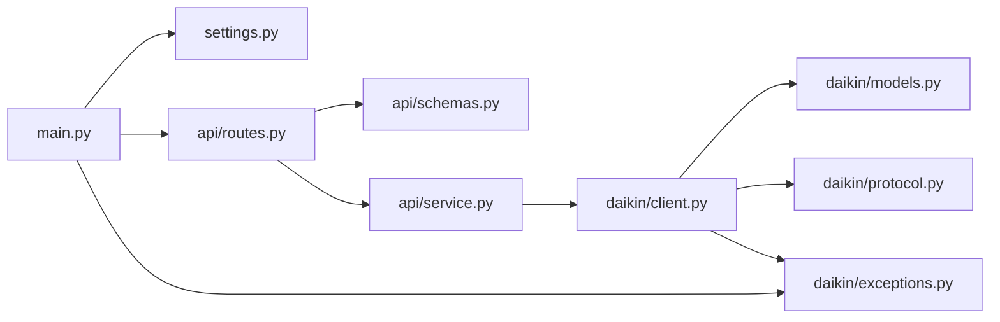

# Daikin MCK706A API

[](https://github.com/msageha/daikin-air-purifier-MCK706A-W/actions/workflows/ci.yaml)

ダイキンの加湿空気清浄機 **MCK706A-W** のローカル `dsiot` API（「DAIKIN Smart
APP」が内部で叩く API）を FastAPI + Pydantic でラップした REST サーバーです。
クラウドを介さず、同一 LAN から空気の状態（温度・湿度・PM2.5 / ホコリ / ニオイの
レベルなど）を取得し、電源・加湿・コース・風量・湿度設定を操作できます。

## セットアップ

このリポジトリは [mise](https://mise.jdx.dev/) の利用を前提としています。

```sh
mise trust    # 初回のみ: このディレクトリの mise.toml を信頼する
mise install  # ツールをインストールし、uv sync と git hooks のセットアップを行う
```

`mise install` を実行すると `[hooks] postinstall` により `uv sync --locked`（依存関係を `.venv` に入れる）と
`prek install`（`.git/hooks/pre-commit` と `.git/hooks/commit-msg` の登録）が自動実行されます。
`.pre-commit-config.yaml` の hook 構成が変わったあとの既存 clone では `mise exec -- prek install` を再実行してください。

以前 `make precommit-install`（pre-commit）で hook を登録していた clone では、`mise exec -- prek install --force` で
旧 hook を置き換えてください。置き換えないと prek が旧 hook（`.git/hooks/pre-commit.legacy`）も実行し、
`uv sync` で削除された pre-commit package を呼んで commit が失敗します。

接続先はリポジトリ直下の `.env` に記載します（`DAIKIN_HOST` は必須、`TIMEOUT` は省略可で既定 10 秒）。
`.env.example` をコピーして編集してください。

```sh
cp .env.example .env
```

```dotenv
DAIKIN_HOST=http://192.168.1.100
TIMEOUT=10
```

## 起動

```sh
mise run dev   # = uv run uvicorn main:app --reload --app-dir src --host 127.0.0.1 --port 8000
```

- Swagger UI: http://127.0.0.1:8000/docs

### Docker

```sh
mise run build-image   # docker build -t daikin-mck706a-api:latest .
mise run run-image     # docker run --rm -p 8000:8000 --env-file .env daikin-mck706a-api:latest
```

多段ビルド（`uv` ビルダ → `python:slim` ランナー、非 root 実行）。

## エンドポイント

| Method | Path                    | 説明                                                                                                |
| ------ | ----------------------- | --------------------------------------------------------------------------------------------------- |
| GET    | `/api/health`           | サーバー状態と接続先                                                                                |
| GET    | `/api/info`             | 機器情報（name / device_type / mac / firmware / 接続中 Wi-Fi の SSID・RSSI / led 等）               |
| GET    | `/api/status`           | 運転状態とセンサー値（電源 / 加湿 / コース / 風量 / 湿度設定 / 温湿度 / 空気質レベル / 各種サイン） |
| GET    | `/api/tree`             | `adr_0100.dgc_status` 全リーフの復号済みツリー                                                      |
| POST   | `/api/read`             | 任意の dsiot アドレスの生読み取り                                                                   |
| POST   | `/api/write`            | 任意プロパティの書き込み（`confirm: true` 必須。無い・false は 422）                                |
| POST   | `/api/power`            | 電源 ON/OFF（`{"on": true}`）                                                                       |
| POST   | `/api/humidify`         | 運転切替。加湿 + 空気清浄 / 空気清浄のみ（`{"on": true}`）                                          |
| POST   | `/api/course`           | コース変更（`{"course": "pollen"}`）                                                                |
| POST   | `/api/fan-speed`        | 手動コースの風量（`{"fan_speed": "turbo"}`）                                                        |
| POST   | `/api/humidity-setting` | 加湿側コースの湿度設定（`{"humidity_setting": "standard"}`）                                        |

### 値の一覧

| 項目               | 値                                                                                                                                   | 備考                                                                                           |
| ------------------ | ------------------------------------------------------------------------------------------------------------------------------------ | ---------------------------------------------------------------------------------------------- |
| `course`           | `smart` `manual` `auto_fan` `econo` `pollen` `moist` `circulator` `laundry_dry` `night_laundry_dry` `water_deodorize` `internal_dry` | MCK706A が選べるのは `smart`〜`circulator`。`moist`（のど・はだ）は加湿運転時のみ              |
| `fan_speed`        | `quiet` `low` `standard` `high` `turbo`                                                                                              | MCK706A は `high` 非対応。コースが `manual` のときだけ運転に反映される                         |
| `humidity_setting` | `off` `low` `standard` `high` `continuous`                                                                                           | MCK706A は `low` / `standard` / `high` のみ。コースが `smart` / `moist` のときは自動で変更不可 |

本体が対応しない値や、現在の運転状態では選べない値（空気清浄のみのときの `moist`、
加湿側コースが `smart` のときの湿度設定）は本体に送らず 409 で返します。対応範囲は本体が
`md.mx`（対応値のビットマスク）として申告するものを使います。

### エラー

| Status | 意味                                                                                        |
| ------ | ------------------------------------------------------------------------------------------- |
| 409    | 本体の対応範囲、または現在の運転状態では行えない操作                                        |
| 422    | リクエストの検証エラー（アドレス形式、`confirm` 欠落、未知の値など）                        |
| 502    | 本体がエラーを返した、または応答を解釈できない（`detail` と dsiot の `rsc`。`200x` が成功） |
| 504    | 本体へ到達できない（タイムアウト・接続拒否）                                                |

`/api/write` で対応範囲外の値（運転切替 `01`、コード 11 以上のコースなど）を書いて
しまうと、以降 `/api/status` はその値を復号できず 502 になります。`GET /api/tree` で
該当プロパティを見つけ、対応する setter（`/api/humidify` `/api/course` `/api/fan-speed`
`/api/humidity-setting`）か `/api/write` で範囲内の値に戻してください。

### 空気状態の取得例

```bash
curl http://127.0.0.1:8000/api/status
```

```json
{
  "power": true,
  "humidify": false,
  "course": "smart",
  "fan_speed": "quiet",
  "humidity_setting": null,
  "temperature_c": 23.0,
  "humidity_pct": 73,
  "pm25_level": 0,
  "dust_level": 0,
  "odor_level": 0,
  "pm25_raw": 659,
  "dust_raw": 624,
  "odor_raw": 1018,
  "water_supply_sign": false,
  "filter_drying": false,
  "deodorizing_filter_off_sign": false,
  "streamer_maintenance_sign": false,
  "error_code": "00-00"
}
```

`course` と `fan_speed` は現在の運転切替（`humidify`）側の設定です。本体は空気清浄側と
加湿側の設定を別々に保持していて、MCK706A では片方を変えると数秒遅れでもう片方にも
同じ値が同期されます（実機で観測）。`humidity_setting` は加湿側コースに対する設定で、
`humidify` が false のときも値を返します。同期が終わるまでの数秒は `course` と
加湿側コースが食い違うので、`/api/course` の直後に `/api/humidity-setting` を叩くときは
`/api/status` で `humidity_setting` が期待どおりか確認してください。

### 操作例

```bash
curl -X POST http://127.0.0.1:8000/api/power \
  -H 'Content-Type: application/json' -d '{"on": false}'

curl -X POST http://127.0.0.1:8000/api/humidify \
  -H 'Content-Type: application/json' -d '{"on": true}'

curl -X POST http://127.0.0.1:8000/api/course \
  -H 'Content-Type: application/json' -d '{"course": "manual"}'

curl -X POST http://127.0.0.1:8000/api/fan-speed \
  -H 'Content-Type: application/json' -d '{"fan_speed": "turbo"}'

curl -X POST http://127.0.0.1:8000/api/humidity-setting \
  -H 'Content-Type: application/json' -d '{"humidity_setting": "standard"}'
```

### 汎用パススルー

読み取り（`/dsiot/edge` を指定すると本体が持つ全アドレスを一括で列挙できます）:

```bash
curl -X POST http://127.0.0.1:8000/api/read \
  -H 'Content-Type: application/json' \
  -d '{"targets":["/dsiot/edge/adr_0100.dgc_status","/dsiot/edge.adp_i"]}'
```

書き込み（破壊的・`confirm` 必須）:

```bash
curl -X POST http://127.0.0.1:8000/api/write \
  -H 'Content-Type: application/json' \
  -d '{"to":"/dsiot/edge/adr_0100.dgc_status","entity_path":["e_1002","e_A002","p_01"],"pv":"00","confirm":true}'
```

- `pv` はリトルエンディアンの16進文字列（偶数長）。
- `entity_path` はレスポンスのルート（`dgc_status`）配下のプロパティ名の連なり。
- 本体は `md.mx` の範囲外の値も拒否せず保存するので、生書き込みでは範囲を自分で守ってください。

## 開発

Python のツールチェーンは uv（依存関係と Python 本体）、ruff（lint + formatter）、ty（型チェック）、pytest です。
それ以外のツールは `mise.toml` の `[tools]` で exact version に pin し、`mise.lock` でプラットフォームごとの
URL / checksum を固定しています。CI（`ci.yaml`）もローカルも同じ `mise.lock` からツールを解決するため、
同じ検証をローカルで再現できます。タスクの一覧は末尾の「[タスク](#タスク)」を参照してください。

```sh
mise run format                          # ruff format .
mise run lint                            # ruff format --check + ruff check + ty check
mise run test                            # coverage run -m pytest + report（オフライン。実機には触れません）
mise exec -- prek run --all-files        # pre-commit hooks を全ファイルに対して実行する（CI の prek job と同じ）
mise exec -- gitleaks git --redact -v .  # コミット履歴全体のシークレットスキャン（CI の gitleaks job と同じ）
```

- [prek](https://github.com/j178/prek): pre-commit hook の実行基盤。hooks は `.pre-commit-config.yaml` で定義します。
  ruff / ty の hook は `uv run --locked` で動かし、バージョンは `uv.lock` に一元化しています。
- [dprint](https://dprint.dev/): json / markdown / toml / yaml のフォーマッタ（`dprint-fmt` hook）。
  plugin の WASM URL は `dprint.json` に `url@sha256` の checksum 付きで pin します。`uv.lock` / `mise.lock` は対象外。
- [actionlint](https://github.com/rhysd/actionlint): workflow の静的検査（`actionlint-system` hook）。
  `run:` スクリプトの検査に [shellcheck](https://github.com/koalaman/shellcheck) を使います。actionlint は PATH に
  shellcheck が無いとその検査を黙って省くため、ローカルと CI で結果が変わらないように mise で pin しています。
- [hadolint](https://github.com/hadolint/hadolint): `Dockerfile` の静的検査（`hadolint` hook）。
- [gitleaks](https://github.com/gitleaks/gitleaks): シークレットスキャン。pre-commit hook（`gitleaks` hook）が
  staged 差分を、CI の `gitleaks` job がコミット履歴全体を対象にします。
- [commitlint](https://commitlint.js.org/): commit message を
  [Conventional Commits](https://www.conventionalcommits.org/) で検査する commit-msg hook（`commitlint` hook）。
  ルールは `commitlint.config.mjs`。prek が node を自前で用意するため、リポジトリに node は不要です。
- [fnox](https://fnox.jdx.dev/): secret manager。`fnox.toml` の `[daemon]` は解決済みの secret をメモリに
  キャッシュする daemon を有効化し、`idle_timeout`（12h）無操作で終了させる設定です。

`.gitignore` はホワイトリスト方式（`*` で全て無視し、`!` で許可したものだけを追跡する）です。
新しく追跡したいファイルを追加する場合は、対応する `!` の行を追記してください。

### mise.toml / mise.lock を手で変更するとき

`mise.toml` の `[tools]` を手で変更したら `mise lock` を実行して `mise.lock` を追従させ、両方を同じ commit に
含めます。CI の mise-action は `mise.lock` があると `mise install --locked` でインストールするため、`mise.lock` が
古いままだと CI の各 job で失敗します。

### 依存関係の更新（Renovate）

`renovate.json` で以下を Renovate に任せています。

- `pyproject.toml` の依存バージョンと `uv.lock` の更新、`uv.lock` の週次再解決（`lockFileMaintenance`）。
- `mise.toml` のバージョン bump と、それに伴う `mise.lock` の更新（同じ PR で行われる）。
- `.pre-commit-config.yaml` の hook `rev` と、`language: node` の hook の `additional_dependencies`。
- workflow の `uses:` の commit SHA（バージョンはコメントで併記し、Renovate が両方を更新する）。
- `Dockerfile` のベースイメージのタグ。
- `dprint.json` の plugin URL と checksum（`customManagers`）。

major 以外の更新は 1 つの PR に集約します。このうち minor / patch は `minimumReleaseAge`（7 日）経過後、
CI green を条件に Renovate 自身が自動マージします（`platformAutomerge: false`）。major は個別 PR で人手レビューします。

### CI

`.github/workflows/ci.yaml` は pull request 時に以下の job を並列実行します。job 名がそのまま
required status check の名前になります。

- `prek`: `mise.lock` 通りのツールで `.pre-commit-config.yaml` の全 hook を `prek run --all-files` で実行します。
  ruff / ty の hook は `uv run --locked` で動くため、`uv.lock` と `pyproject.toml` の不整合もここで失敗します。
- `gitleaks`: コミット履歴全体を対象にシークレットスキャンを行います。
- `verify`: `uv run --locked pytest` でテストを実行します。

main への push では実行しません（main は PR 必須で、変更は PR の CI で検証してから merge されます）。
workflow の外部依存（`uses:`）は commit SHA で固定し、バージョンをコメントで併記します。

### Claude Code

- `claude.yaml`: issue / PR コメント等の `@claude` メンションで
  [claude-code-action](https://github.com/anthropics/claude-code-action) を起動します。`author_association` が
  OWNER / MEMBER のメンションだけを通します。
- `claude-sweep.yaml`: 毎週月曜に、前回レビュー済み地点（tag `claude-reviewed`）から HEAD までの差分を
  correctness / security / simplification の観点でレビューし、新規の指摘を `claude-sweep` label 付きの issue として
  起票します。修正 PR は作りません。tag が無い初回は tag を張るだけで終了し、差分が無ければ Claude を起動しません。
  `workflow_dispatch` で手動実行できます。

実行にはリポジトリ secret `CLAUDE_CODE_OAUTH_TOKEN` が必要です。未設定のまま workflow が動くと
`CLAUDE_CODE_OAUTH_TOKEN ... is required` で失敗します。

```sh
claude setup-token   # Claude Code の OAuth トークンを発行
gh secret set CLAUDE_CODE_OAUTH_TOKEN --repo msageha/daikin-air-purifier-MCK706A-W
```

### GitHub リポジトリ設定

ファイルとして管理できないリポジトリ設定です。public リポジトリなので ruleset と secret scanning が使えます。
required checks は `ci.yaml` の job 名（`prek` / `gitleaks` / `verify`）に合わせます。

```sh
REPO=msageha/daikin-air-purifier-MCK706A-W

# merge 方式: squash のみ / squash タイトルは COMMIT_OR_PR_TITLE /
# merge 後にブランチ自動削除 / wiki off
gh api -X PATCH "repos/$REPO" --input - <<'JSON'
{
  "allow_merge_commit": false,
  "allow_rebase_merge": false,
  "allow_squash_merge": true,
  "squash_merge_commit_title": "COMMIT_OR_PR_TITLE",
  "squash_merge_commit_message": "COMMIT_MESSAGES",
  "delete_branch_on_merge": true,
  "has_wiki": false
}
JSON

# main を PR 必須・CI green 必須・squash merge 限定・force push / 削除禁止・linear history にする
gh api -X POST "repos/$REPO/rulesets" --input - <<'JSON'
{
  "name": "Protect main",
  "target": "branch",
  "enforcement": "active",
  "bypass_actors": [],
  "conditions": {"ref_name": {"include": ["refs/heads/main"], "exclude": []}},
  "rules": [
    {"type": "deletion"},
    {"type": "non_fast_forward"},
    {"type": "required_linear_history"},
    {"type": "pull_request", "parameters": {
      "required_approving_review_count": 0,
      "dismiss_stale_reviews_on_push": false,
      "require_code_owner_review": false,
      "require_last_push_approval": false,
      "required_review_thread_resolution": false,
      "allowed_merge_methods": ["squash"]
    }},
    {"type": "required_status_checks", "parameters": {
      "do_not_enforce_on_create": false,
      "strict_required_status_checks_policy": false,
      "required_status_checks": [
        {"context": "prek", "integration_id": 15368},
        {"context": "gitleaks", "integration_id": 15368},
        {"context": "verify", "integration_id": 15368}
      ]
    }}
  ]
}
JSON

# secret scanning: push protection に加え、non-provider patterns も有効化する
gh api -X PATCH "repos/$REPO" --input - <<'JSON'
{
  "security_and_analysis": {
    "secret_scanning": {"status": "enabled"},
    "secret_scanning_push_protection": {"status": "enabled"},
    "secret_scanning_non_provider_patterns": {"status": "enabled"}
  }
}
JSON
```

### template との同期

共通ファイル（workflow・hook 設定・Renovate 設定・dprint 設定等）は
[dope-corp/template](https://github.com/dope-corp/template) から取り込んでいます。`mise run template-diff` で
template の main と比較して unified diff を表示します。差分にはこのリポジトリ固有の変更（Python 向け hook・
`verify` job・issue form の `labels:` 等）も混ざるので、取り込むものは手で選んでください。

## 仕組み

新しめのダイキン機（ファームウェア `3_15_0` / `api_ver 2_2` の MCK706A）は、
旧来の `/cleaner/*`・`/common/*` といった REST エンドポイントを持たず、単一の
JSON エンドポイントだけを公開しています。

```
POST http://<host>/dsiot/multireq
```

ボディは `requests` 配列で、各要素が操作コード `op` と対象パス `to` を持ちます。

- `op=2` … プロパティツリーの**読み取り**
- `op=3` … プロパティツリーの**書き込み**（`pc`）

レスポンスは*プロパティノード*のツリーです。各ノードは以下を持ちます。

- `pn` … プロパティ名（`e_1002`, `p_01` など）
- `pt` … 型（`1`=子 `pch` を持つコンテナ、`2` / `3`=リーフ。実機では概ね設定値が `2`、
  センサー・固定情報が `3`。書き込み本文のリーフは `pt: 3` で送っても受け付けられる。実機で確認）
- `pv` … 値（リーフのみ）
- `md` … メタ情報。`md.pt` が値の符号化方式（`"b"`=リトルエンディアン16進バイト列、
  `"i"`=整数、`"s"`=文字列）、`md.mi`/`md.mx` が最小/最大値（16進）。列挙型の
  プロパティでは `md.mx` が対応値のビットマスク（bit n = 値 n）
- `rsc` … 結果コード。`200x` が成功（公式アプリの扱い。MCK706A は書き込み成功時に `2004` を返す）、
  `4000` パラメータ不正（公式アプリの定義）、`4041` 存在しないアドレス（実機で観測）

> 認証はありません。LAN 内の誰でも読み書きできます。

### アドレス

`/dsiot/edge` を読むと配下の全アドレスがまとめて返ります。MCK706A で読めるもの:

| アドレス                                            | 内容                                                                | 使う endpoint                       |
| --------------------------------------------------- | ------------------------------------------------------------------- | ----------------------------------- |
| `/dsiot/edge/adr_0100.dgc_status`                   | 制御とセンサー                                                      | `/api/status` `/api/tree` 各 setter |
| `/dsiot/edge.adp_i`                                 | アダプタ情報（FW / MAC / 自身の AP の SSID / api_ver / 機能フラグ） | `/api/info`                         |
| `/dsiot/edge.adp_d`                                 | ユーザー設定（名前 / LED / タイムゾーン / 自動 OFF 通知）           | `/api/info`                         |
| `/dsiot/edge.adp_r`                                 | 無線の接続状態（接続中 SSID / RSSI）と再起動・FW 更新の履歴         | `/api/info`                         |
| `/dsiot/edge.dev_i`                                 | 機器種別（`type` = `1D` が空気清浄機）と接続台数                    | `/api/info`                         |
| `/dsiot/edge.adp_f`                                 | FW 種別と自動更新の有効/無効                                        | `/api/read` のみ                    |
| `/dsiot/edge/adr_0100.scdl_t.info` / `.scdl_t.body` | 週間スケジュールタイマー（JSON 値）                                 | `/api/read` のみ                    |
| `/dsiot/edge/adr_0200.dgc_status`                   | 空（室外機側。空気清浄機には無い）                                  | —                                   |

`adr_0100.history`（アプリの空気質履歴）と `adr_0100.i_power.*`（消費電力）は
この機体では `4041` で読めません。

### プロパティ対応表

`dgc_status` 配下のプロパティの意味は、公式 DAIKIN Smart App の空気清浄機向け定義
（`GPFCjConvertValue` の enum 表と `strings.xml` のラベル）を一次情報とし、実機
（MCK706A / FW 3_15_0）で読み書きして確認しています。

| フィールド                                 | プロパティ                                           | 値                                                                                                     | 確認                                       |
| ------------------------------------------ | ---------------------------------------------------- | ------------------------------------------------------------------------------------------------------ | ------------------------------------------ |
| `power`                                    | `e_1002/e_A002/p_01`                                 | `00` / `01`                                                                                            | 実機で書き込み確認                         |
| `humidify`                                 | `e_1002/e_3001/p_3F`                                 | `00` 空気清浄、`01` 除湿+空気清浄（MCK706A 非対応）、`02` 加湿+空気清浄                                | 実機で書き込み確認                         |
| `course`                                   | `e_1002/e_3007/p_01`（空気清浄側）/ `p_03`（加湿側） | 2 バイト LE。下位バイトがコード（`00` smart … `06` circulator … `0A` internal_dry）、上位バイトは `00` | 実機で書き込み確認                         |
| `fan_speed`                                | `e_1002/e_3007/p_04`（空気清浄側）/ `p_06`（加湿側） | `00` quiet … `04` turbo                                                                                | 実機で書き込み確認                         |
| `humidity_setting`                         | `e_1002/e_3007/p_12`〜`p_1C`（加湿側、コース順）     | `00` off、`01` low、`02` standard、`03` high、`04` continuous                                          | 実機で書き込み確認（`p_13`）               |
| `temperature_c`                            | `e_1002/e_A00B/p_01`                                 | int16 LE、0.5 ℃ 単位（`md.st`=0xF5）                                                                   | 実機で確認                                 |
| `humidity_pct`                             | `e_1002/e_A00B/p_02`                                 | %                                                                                                      | 実機で確認                                 |
| `pm25_level` / `dust_level` / `odor_level` | `e_1002/e_3007/p_1D` / `p_1E` / `p_1F`               | 0〜5                                                                                                   | 公式アプリ定義（読み取りのみ）             |
| `pm25_raw` / `dust_raw` / `odor_raw`       | `e_1002/e_3007/p_26` / `p_27` / `p_28`               | 24 bit                                                                                                 | アプリの履歴グラフの元値と推定。単位未特定 |
| `water_supply_sign`                        | `e_1002/e_3007/p_20`                                 | flag                                                                                                   | 公式アプリ定義                             |
| `filter_drying`                            | `e_1002/e_3007/p_29`                                 | flag                                                                                                   | 公式アプリ定義                             |
| `deodorizing_filter_off_sign`              | `e_1002/e_3007/p_3E`                                 | flag                                                                                                   | 公式アプリ定義                             |
| `streamer_maintenance_sign`                | `e_1002/e_3001/p_40`                                 | flag                                                                                                   | 公式アプリ定義                             |
| `error_code`                               | `e_1002/e_A004/p_09`                                 | ASCII（`00-00` = 正常）                                                                                | 公式アプリ定義                             |

公式アプリの定義に無く意味が未特定のプロパティ（`e_3007/p_2B`〜`p_3D` の一部、
`e_205E`、`e_205F_*` など）は `/api/status` には含めず、`GET /api/tree` で生の値を
確認できます。一定間隔でポーリングして「変動するフィールド」を炙り出すのが手です。

## 構成

`src/` 直下をトップレベルパッケージとして解決する virtual プロジェクト（ビルドなし）。
実行・テストは `--app-dir src` / `pythonpath = ["src"]` / `PYTHONPATH=src` で解決します。

```
src/
  daikin/          dsiot ローカル API クライアント（FastAPI 非依存・単体利用可）
    protocol.py      multireq 本文の組み立て、16 進デコーダ、PropertyTree
    models.py        Course / FanSpeed / HumiditySetting、DeviceInfo / AirStatus / DecodedLeaf
    client.py        DaikinClient（通信、MCK706A のアドレス・プロパティパス・wire 値、高レベル API）
    exceptions.py    DaikinError / DaikinConnectionError / DaikinUnsupportedError
  api/             FastAPI 層
    routes.py        エンドポイント定義
    schemas.py       request モデル
    service.py       DaikinClient を lock + worker thread で直列実行する DaikinService
  settings.py      環境変数（pydantic-settings）
  main.py          FastAPI アプリと、例外 → HTTP status の対応
tests/             オフライン単体テスト（src の構成をミラー）
```



新しいプロパティを公開するときは、`client.py` にプロパティパスの定数と
`tree.decode(パス, デコーダ)` の 1 行、`models.py` に対応するフィールドを足します。
デコーダ（`hex_to_int` / `hex_to_bool` / `hex_to_temp` / `int_to_bool` など）は
`protocol.py` にあります。

## 注意

- ローカルネットワーク内（同一サブネット）からの利用を想定しています。認証は
  ありません。
- ファームウェアによってフィールドが異なる場合があります。`/api/info`・`/api/status`
  は既知のフィールドだけを返すので、生の値は `/api/tree`（復号済み）や `/api/read`
  （dsiot 応答そのまま）で確認してください。

## 免責 / Disclaimer

本プロジェクトは **ダイキン非公式**であり、ダイキン工業株式会社とは一切関係あり
ません。公開されていないローカル API をリバースエンジニアリングして利用しています。

- **自分が管理権限を持つ機器に対してのみ**使用してください。
- ファームウェア更新で API が予告なく変わる可能性があります。
- 本ソフトウェアは現状有姿（AS IS）で提供され、いかなる保証もありません。

## 謝辞 / Acknowledgements

`dsiot`（`/dsiot/multireq`）プロトコルの構造と温度/湿度のデコード方式は、ダイキンの
新ファームウェア（BRP084 系）を対象とした以下の公開リバースエンジニアリング成果を
参考にしています。

- [Apoc182/local_daikin](https://github.com/Apoc182/local_daikin)
- [Chris971991/homeassistant-daikin-optimized](https://github.com/Chris971991/homeassistant-daikin-optimized)

空気清浄機（Cj）向けのプロパティ対応表・`rsc` コード・`md.mx` のビットマスク解釈は、
公式アプリの decompile を整理した以下を参照しました。

- [gpdl49/ha-daikin-india](https://github.com/gpdl49/ha-daikin-india)（`docs/api-spec.md`）
- [tthophan/daikin-smart-app](https://github.com/tthophan/daikin-smart-app)（`GPFCjConvertValue.smali`、`res/values/strings.xml`）

MCK706A 固有の対応範囲（`md.mx`）と書き込み時の挙動は実機（FW 3_15_0）で確認しました。

## ライセンス / License

[MIT](LICENSE)

## タスク

タスクは `mise run <task>` で実行します。`mise.toml` の `[tasks]` を変更した場合は
`mise run docs` を実行し、以下の一覧を更新してください（pre-commit hook からも自動実行されます）。

<!-- dprint-ignore-start -->
<!-- mise-tasks -->
## `build-image`

- **Usage:** `build-image`

Build the Docker image daikin-mck706a-api:latest

## `clean`

- **Usage:** `clean`

Remove caches and coverage artifacts

## `dev`

- **Usage:** `dev`

Run the API server with auto-reload on http://127.0.0.1:8000

## `docs`

- **Usage:** `docs`

Sync the task list embedded in README.md with mise.toml

## `format`

- **Usage:** `format`

Format python sources with ruff

## `lint`

- **Usage:** `lint`

Check formatting (ruff format --check), lint (ruff check) and types (ty check)

## `run-image`

- **Usage:** `run-image`

Run the Docker image on port 8000 with .env passed via --env-file

## `template-diff`

- **Usage:** `template-diff`

Diff shared files against dope-corp/template main

## `test`

- **Usage:** `test`

Run pytest under coverage and print the report
<!-- /mise-tasks -->
<!-- dprint-ignore-end -->
